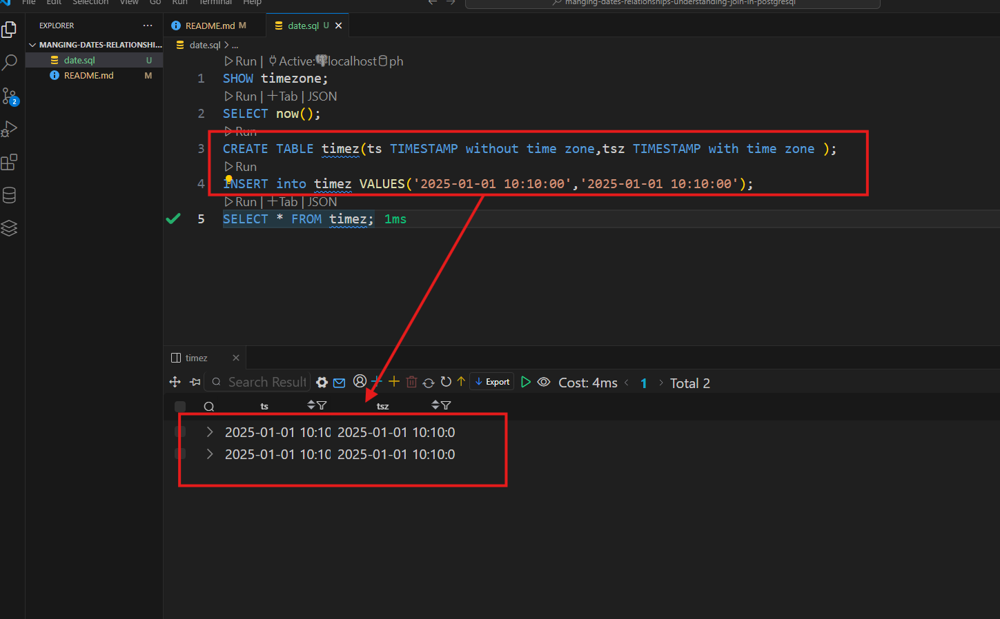
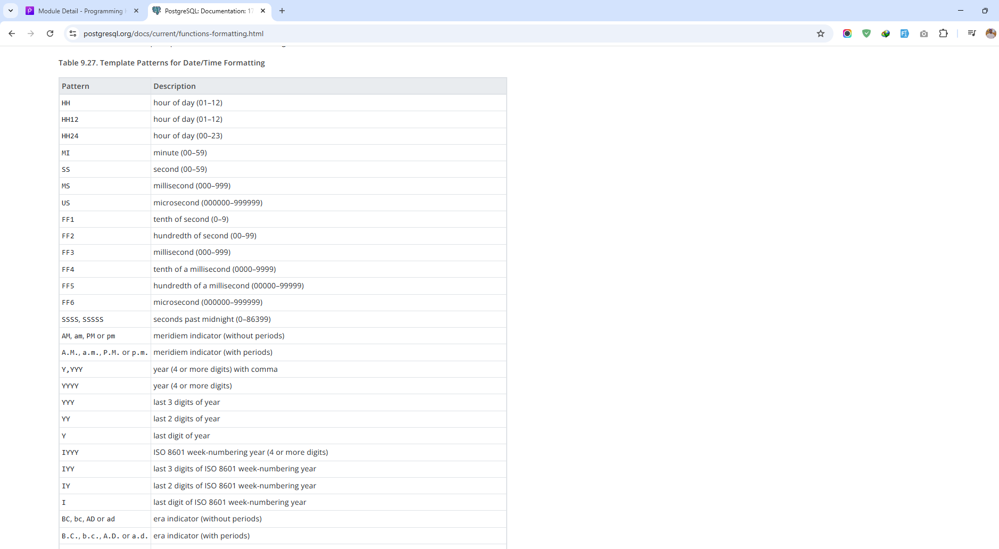
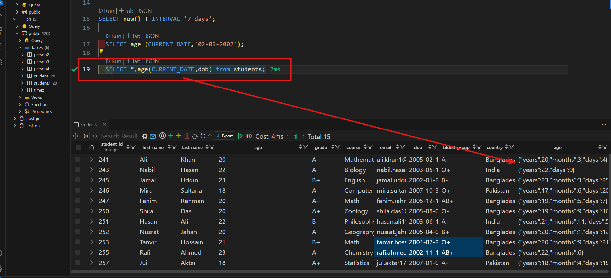
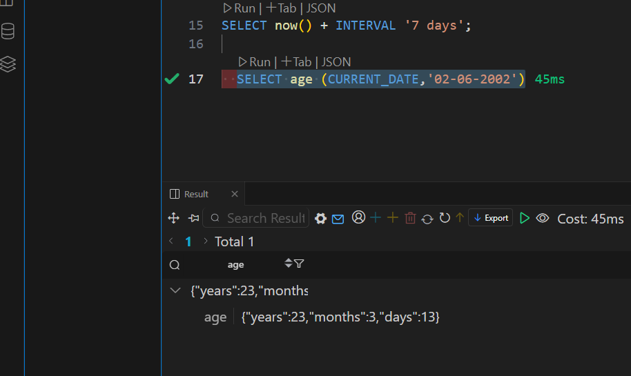
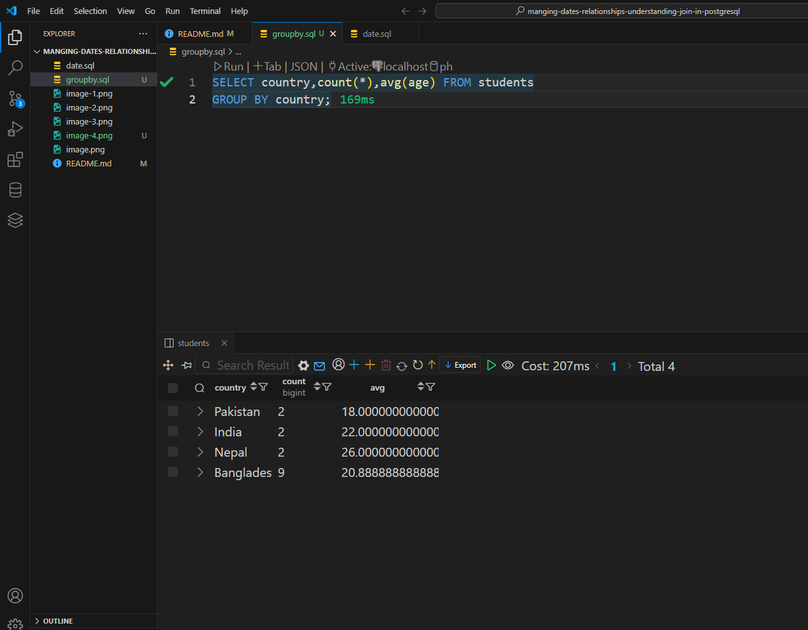
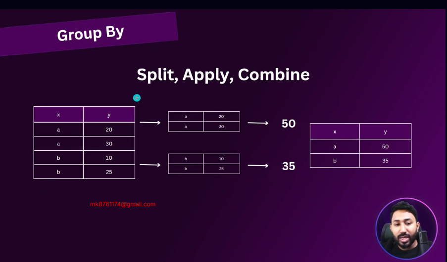
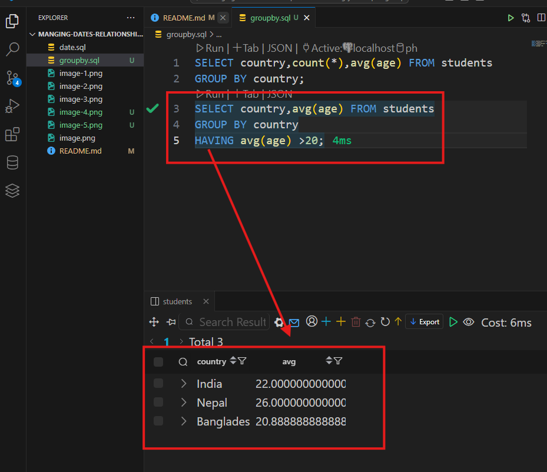
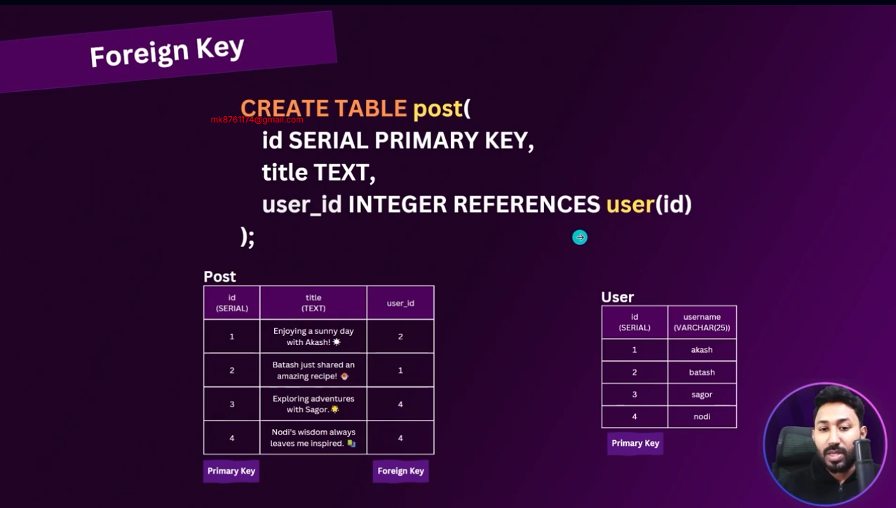

## Module 9:Managing Dates,Relationships and Understanding Join In PostgreSQL
GitHub Link: https://github.com/Apollo-Level2-Web-Dev/dbms-postgres


Practice File: https://like-frog-b41.notion.site/SQL-Join-Practice-Task-27ac979408f5477da80de4ab299f9225?pvs=4

##  9-1 Handling Date and Date Functions in PostgreSQL

```sql

SHOW timezone --- asia dhaka
SELECT now(); -- date and time show

CREATE TABLE timez(ts TIMESTAMP without time zone,tsz TIMESTAMP with time zone );
INSERT into timez VALUES('2025-01-01 10:10:00','2025-01-01 10:10:00');
SELECT * FROM timez;

-- custom date and time
SELECT CURRENT_DATE;

SELECT now():: time;

--- first time stamp and second date format many format go to google
SELECT to_char(now(),'yyyy/mm/dd')

```


In PostgreSQL, the INTERVAL data type is used to store a duration or time span — for example, days, hours, minutes, and seconds. It’s commonly used when you want to add or subtract time to/from a timestamp or date.
```sql
SELECT CURRENT_DATE - INTERVAL '1 year 2 month';

SELECT now() + INTERVAL '7 days';

  
 SELECT *,age(CURRENT_DATE,dob) from students;

```
  

```sql
---- age function
  SELECT age (CURRENT_DATE,'02-06-2002')
  
  ```
  
# extract function
```sql
--- day ,year ,month find out
 SELECT extract (MONTH from '2025-05-19'::date)
```

## 9-2 Grouping and Filtering Data with GROUP BY and HAVING
```sql
SELECT country,count(*),avg(age) FROM students
GROUP BY country;

SELECT country,avg(age) FROM students
GROUP BY country
HAVING avg(age) >20;
--- count student Born in Each Year
SELECT extract(year from dob) as birth_year, count(*)
from students
GROUP BY birth_year;
```




## 9-3 Constructing Relationships with Foreign Key Constraints



```sql 
create Table "user"(
    id SERIAL PRIMARY KEY,
    user_name VARCHAR(40) NOT NULL
);

CREATE Table post(
    id SERIAL PRIMARY KEY,
    title TEXT not NULL,
    user_id INT REFERENCES "user"(id) NOT NULL
);
ALTER TABLE post
alter COLUMN user_id set not NULL; 

INSERT INTO "user"(user_name) VALUES
('akash'),
('batash'),
('nodi'),
('mala');

INSERT into post(title,user_id) VALUES();
SELECT * FROM "user";


INSERT INTO post (title, user_id) VALUES
('Enjoying a sunny day with Akash! ☀️', 2),
('Batash just shared an amazing recipe! 🍲', 1),
('Exploring adventures with Sagor.🌟', 4),
('Nodi''s wisdom always leaves me inspired. 📚', 4);

SELECT * FROM post;

-- Insertion constraint on INSERT post
-- Attempting to insert a post with a user ID that does not exist
INSERT INTO post (title, user_id) VALUES('test',1)

-- Inserting a post with a valid user ID
-- Attempting to insert a post without specifying a user ID
INSERT INTO post (title, user_id) VALUES('test',NULL)
```